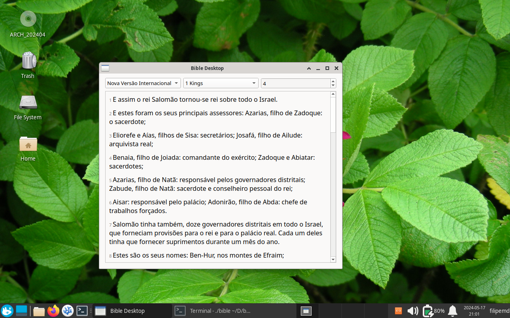

# Bible CLI



Um simples programa de Bíblia escrito em C e a biblioteca [cJSON](https://github.com/DaveGamble/cJSON).

Os dados em JSON da Bíblia foram extraídos usando o [PyBible](https://github.com/filipemd/PyBible).

## Como compilar

 - Baixe o código-fonte;
 - Baixe o GCC (outros compiladores podem funcionar, mas eu não testei com nenhum outro além do GCC) e o Makefile (pré-instalado em muitos sistemas).
 - Baixe o QT.
 - Abra a pasta do código-fonte e digite `make` para compilar. Este comando compila tanto a cJSON, quanto o programa. Caso queira compilar apenas para linha de comando, digite `make CLI=true`. Você não vai precisar instalar o QT.
 - Caso queira instalar o programa, digite `sudo make install`. No Linux, é só digitar `bible` no terminal. No MacOS, vai aparecer um programa chamado `bible` junto com os outros aplicativos.

Vai aparecer um executável chamado `bible`. Se você não estiver usando Linux, podem aparecer erros. Eles serão provavelmente resolvidos no futuro. Este programa quase certamente não funcionará no Windows, a não ser que seja utilizado o WSL (Windows Subsystem for Linux).

## Como utilizar a versão CLI

Digitando `./bible --cli` (ou apenas `./bible`, caso você compilou a versão para linha de comando) na pasta do programa, vai aparecer isto:

```
Usage: 
bible <version> <book> <chapter> <verse>
```

 - version  - versão
 - book     - livro
 - chapter  - capítulo
 - verse    - versículo

Se você não colocar o versículo, vai aparecer o capítulo inteiro.